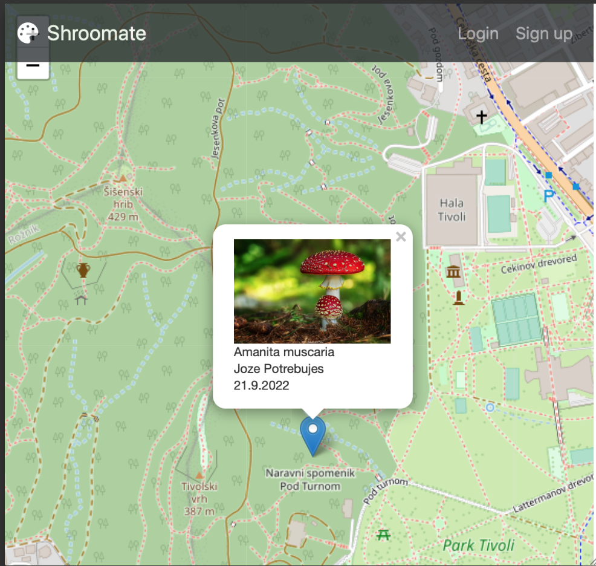
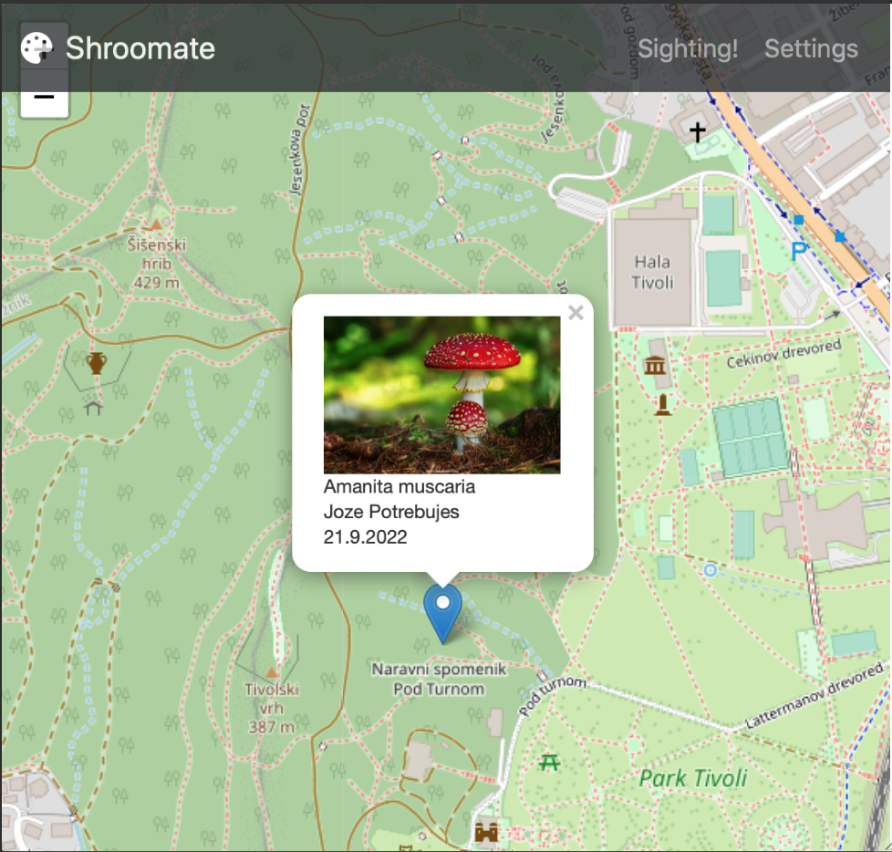
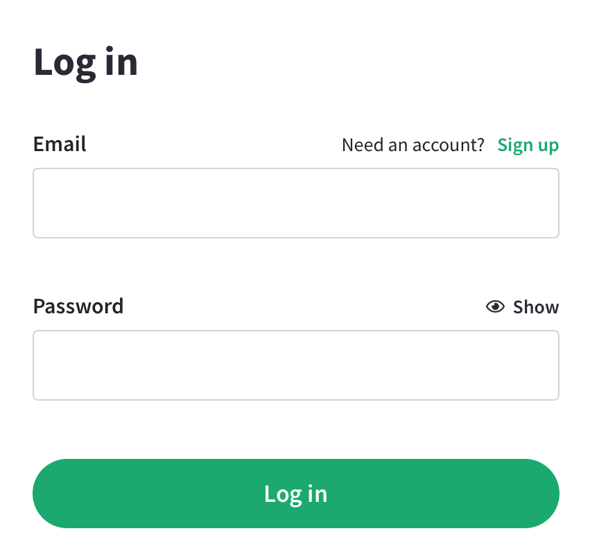
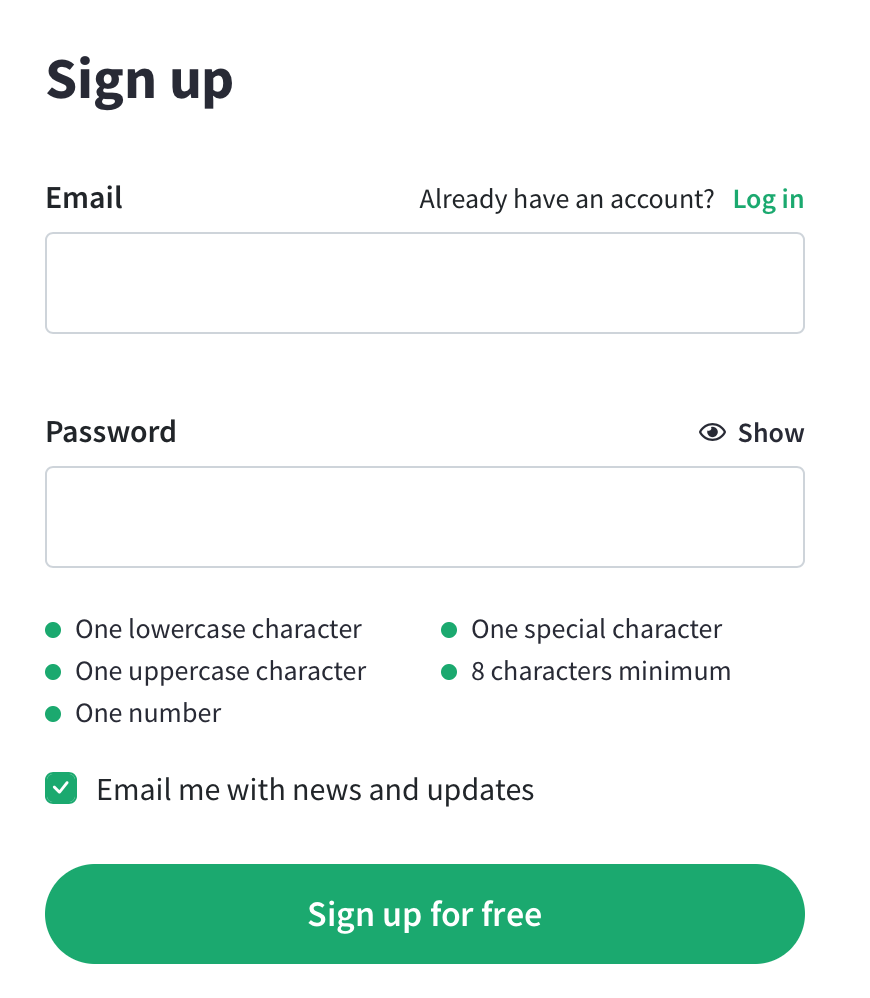

# Shroomate

**Shroomate** je gobarski pomočnik, ki beleži gobarske dosežke uporabnikov in jih raztrosi v zaintersirano javnost. Seveda le do dovoljene mere, saj je vendar jasno, da so gobarski tereni skrbno varovana skrivnost.
Pomočnik je dostopen na https://shrooma.te. 

## Osnovno

*Firbcu*, tj. neprijavljenemu uporabniku, so v osnovnem pogledu na zemljevidu predstavljene nabrane gobe (ki so jih nabrali *gobarji* in za katere so le-ti smatrali, da se lahko predstavijo širši javnosti). Klik na oznako na zemljevidu *firbcu* prikaže detajle nabranega, s sliko, datum/časom, vrsto gob, ...

V osnovnem pogledu sta še povezavi na prijavo obstoječega in registracijo novega uporabnika, tj. *gobarja*, morebiti pa tudi časovni filter, ki filtrira prikaz za določeno časovno obdobje (npr. zadnji teden, mesec, lani ob istem času...).

Nov *gobar* se mora najprej registrirati, z vnosom nadimka, poštnega naslova in gesla.

*Gobar* se prijavi, bodisi s poštnim naslovom bodisi z nadimkom, in geslom.

V sistemu je tudi *veliki gobar*, tj. administratorski uporabnik, ki skrbi za onemogočanje uporabnikov v primeru kršitev pogojev uporabe in za druge trenutno še neznane stvari.

## Za gobarje

Tako kot nož in koš, tudi **Shroomate** spremlja gobarja na njegovih podvigih, čakajoč na akcijo v gobarjevi mobilni napravi:

- pred gobarskim pohodom gobar na zemljevidu pregleduje dosežke sogobarjev; s filtri za npr. vrste gob, sezono/datum, ... mu **Shroomate** pomaga pri odločitvi, kam na naslednji pohod

- pri premikanju skozi gobarske terene ima na voljo zemljevid z njegovo lokacijo in najdbe v njegovi bližini, lahko tudi kot pomoč pri navigaciji, v kolikor še ne pozna terenov

- ko se goba najde, gobar najprej izbere **Najdba!**; v modalnem dialogu gobar vnese *vrsto gobe*, kategorijo *vidnosti* (kateri gobarjem bo najdba vidna: *vsem*, *prijateljem*, *samo meni*) in *zaznamek* (občutki, opis dogodivščine, ...), samodejno se zabeležita lokacija in datum-čas, seveda pa lahko doda tudi slike najdbe. Najdba lahko pomeni več gob, ki pa so iste vrste.

## Nastavitve

Gobar lahko določi:

- **prijatelje**: gobarje, ki lahko vidijo njegove *delno skrivne* najdbe; prikazani so kot seznam z možnostjo izbire večih elementov; izbrani elementi se odstranijo z gumbom **Odstrani**, novi prijatelji pa dodajo z izbiro elementov v seznamu **Vsi gobarji** in gumbom **Dodaj**

- **skrivanje lokacij**: za vsako od vidnosti najdb *vsem* in *prijateljem*, lahko določi skrivanje lokacije:
  - *natančno*: lokacija se ne spremeni pred predstavitvijo najdbe
  - *mikrolokacija*: skrije se mikrolokacija, tj. pred predstavitvijo najdbe se lokacijo spremeni tako, da mikrolokaija ni na voljo (npr. psevdonaključni zamik)
  - *regija*: predstavi se le regija, tj. pred predstavitvijo najdbe se lokacijo spremeni tako, da je vidna samo širša regija najdbe (npr. zaokrožanje na centre večjih delov območja)

# UI / mockup

*Settings* in *Sighting!* sta podobno kot *Log in* in *Sign up* modalna dialog z zgoraj opisanimi polji.

# Opombe

- Zemljevid se izvede z https://leafletjs.com (zunanji vir)
- Vrsto gob se pridobi iz https://www.gobe.si/Gobe/GobeIndexSI (zunanji vir)
- 