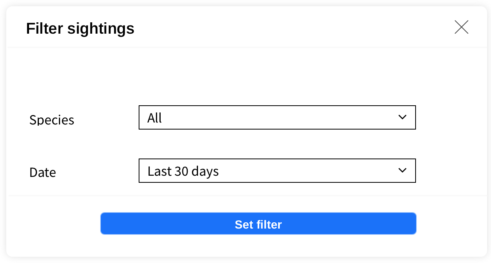

# Filtering sightings in master view

*Filter* modal defines filtering of sightings in master view. It contains:
- multiselect input for *species*, with option *All* added at the beginning (default *All*)
- selector for of *date* of sighting, options *All*, *Last 7 days*, *Last 30 days*, *This year* (default *Last 7 days*)
  

