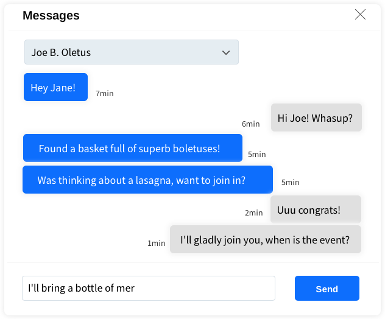

# Messages

*Messages* modal enables user to message other users. It contains:
- select input for peer *user*,
- list of previous messages from and to the selected user
- text input to write message, with *Send* button
  

