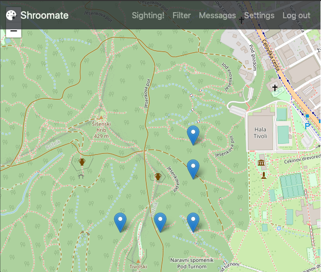
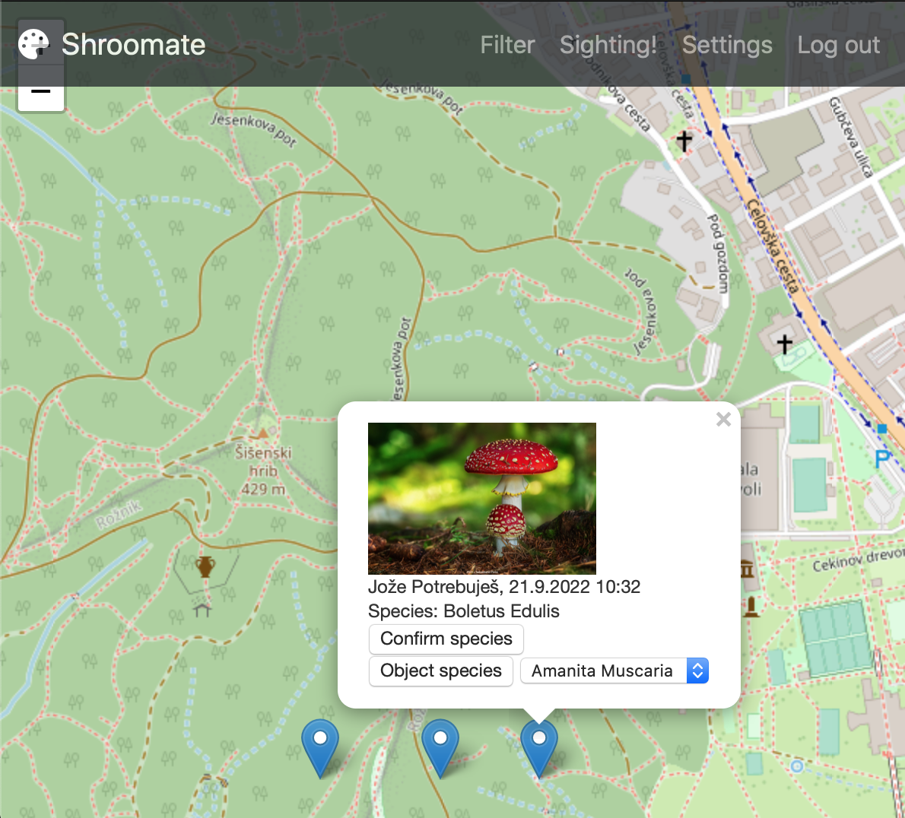
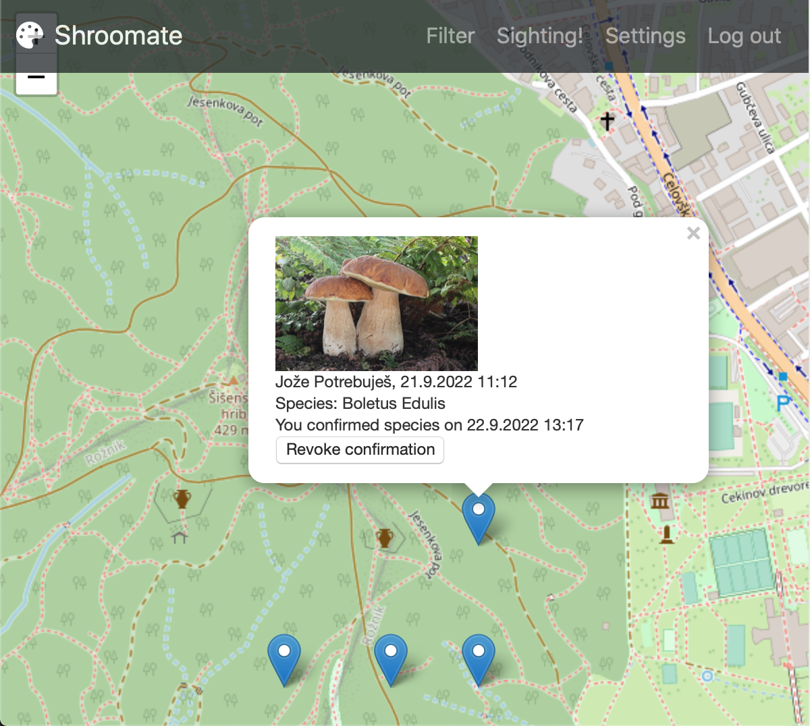
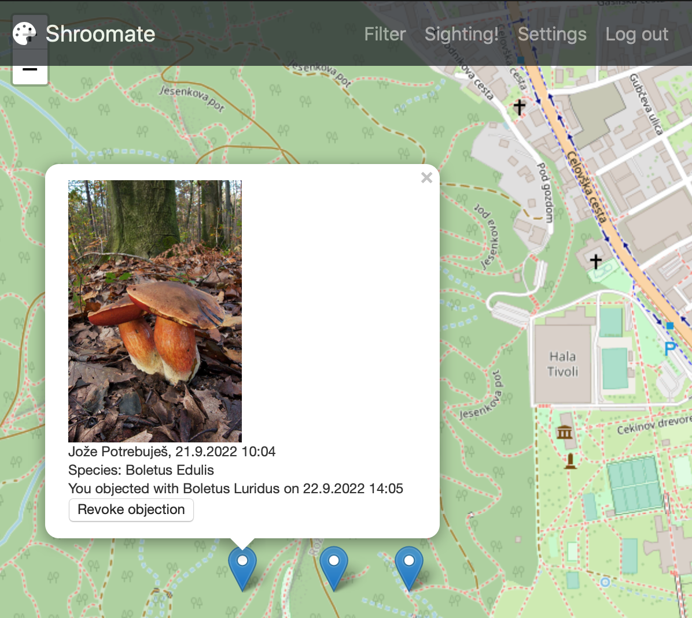
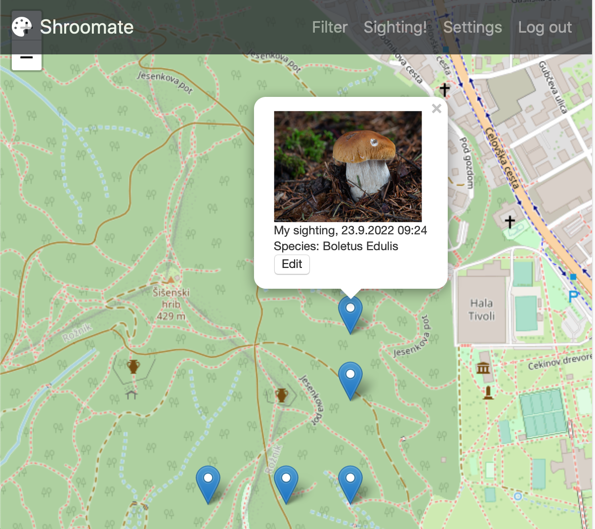

# Registered user

Registered user interacts with a map overlayed with (filtered) sightings of (registered) users as markers.

Aditionally, on top of the page there is a navbar with actions to
- [filter](filter.md) sightings
- create new [sighting](signup.md)
- edit user [settings](settings.md)
- log out of user account and get to [unregistered user](unregistered.md) page

## Master view

## Details view

Click on a marker shows details of the respective sighting.

Interaction with details of **other user's sightings**:
-  user can confirm or object to the proposed *species* with respective buttons
-  user can revoke existing confirmation and objection with a *revoke* button

Interaction with details of **user's own sightings**:
- user can change details of sighting via *Edit* button that opens [Sighting](sighting.md) modal

