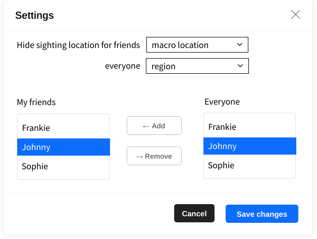

# Settings

*Settings* modal includes settings for

- hidding locations for user groups *friends* and *everyone*; possible values are *micro location*, *macro location*, and *region*

- managing of *friends*, with lists of current friends and non-friends (i.e. other users), *Add* and *Remove* buttons
  

