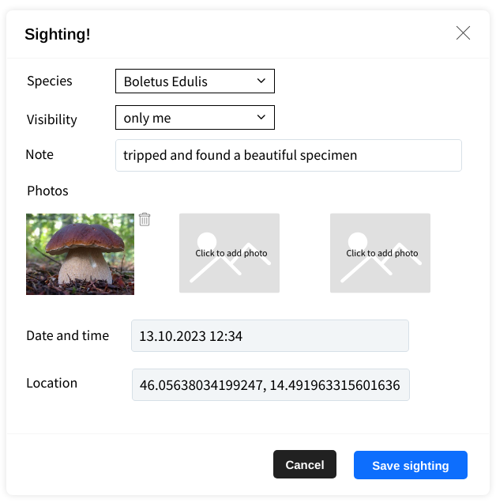

# Sighting

*Sighting* modal has 
  - inputs for *species* (selector), *visibility* (selector), and *note* (text input)
  - input for up to three *photos* of the sighting
  
When used for creating a new sighting it automatically includes *location* and *timestamp*.

When used for editing an existing sighting, *location* and *timestamp* cannot be changed.

