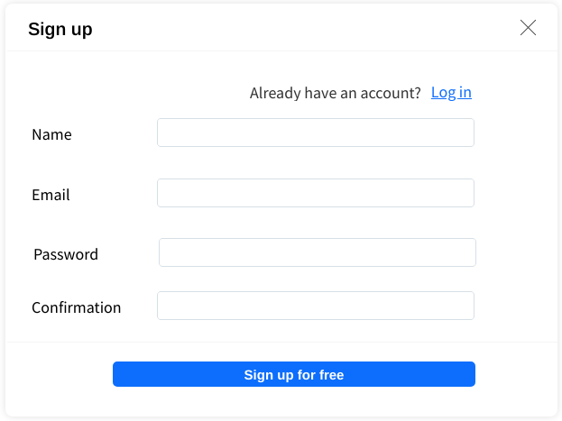

# Sign up

With the *Sign up* modal user signs up with *name*, *email*, *password* and *password confirmation*.

Upon successful submit an email is sent to the given email address with a link to confirm the registration.
After the registration is confirmed, the account is enabled.

Default settings are applied to the newly created user.

